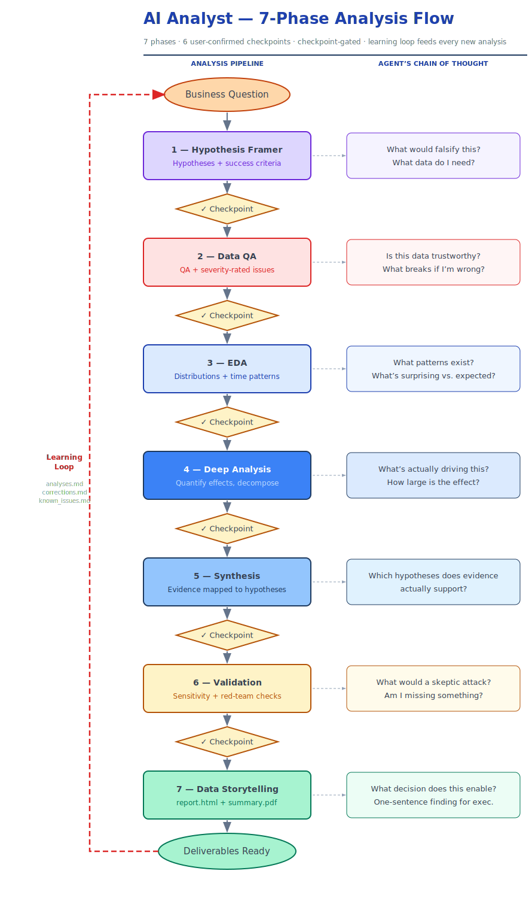

<div align="center">

# 🧩 AI Workshop for Data Teams

### Turning a general-purpose AI assistant into a disciplined **AI Analyst**

Structured, end-to-end analyses on Supabase data — with checkpoint-gated phases<br/>and a learning loop that gets sharper with every session.

[](./analyses/_template/plan.md)
[](./analyses/_template/plan.md)
[](https://supabase.com)
[](#-for-workshop-attendees)
[](#-the-learning-loop)

</div>

---

## 🎯 Why This Matters

Point a general-purpose AI assistant at a database and it will happily answer — confidently, and often **wrong**. It invents column names that "should" exist, reconstructs metric logic from its name, guesses at ambiguous grain, and hands you a polished number with no way to tell it apart from a real one.

This repo fixes that by turning the assistant into a **disciplined analyst**. Every analysis is constrained by three things:

- **A ground-truth semantic model** — schema and metrics come from a versioned source, never from memory. If a column or metric isn't defined, the agent stops and asks instead of guessing.
- **Seven gated phases** — the work moves question → hypotheses → QA → exploration → deep analysis → synthesis → validation → report, and *cannot skip ahead* without your explicit confirmation at each checkpoint.
- **A learning loop** — corrections, known data issues, and prior findings persist across sessions, so the agent gets sharper with every analysis instead of repeating mistakes.

The result is analysis you can actually trust, with a paper trail for every claim.

---

## 🧭 The Flow

Every analysis runs through **7 phases in order**. Each phase ends with a user-confirmed checkpoint before the next one begins. No phase is skipped. No phase advances without explicit confirmation.

<p align="center">
  
</p>

> [!NOTE]
> The dashed arrows on the right show what the agent is **thinking** at each phase — the chain of reasoning behind every output. The red loop on the left is the **learning loop**: after each analysis, `.claude/learning/` is updated, and those lessons feed directly into the next analysis.

---

## 🗂️ What's in Here

```
CLAUDE.md                        # The agent's behavioral contract — read first
.claude/
├── rules/                       # The non-negotiable guardrails
│   ├── ground-truth.md          #   schema + metrics are the single source of truth
│   ├── no-guessing.md           #   stop and ask instead of inventing
│   └── sql-conventions.md       #   SQL style + safety conventions
├── skills/                      # The seven analysis skills
│   ├── hypothesis-framer/       # 1. Turn questions into testable hypotheses
│   ├── data-qa/                 # 2. Validate data health, severity-rated issues
│   ├── eda/                     # 3. Explore distributions, relationships, time
│   ├── deep-analysis/           # 4. Quantify effects, decompose drivers
│   ├── synthesis/               # 5. Map evidence to hypotheses
│   ├── validation/              # 6. Stress-test conclusions before delivery
│   ├── data-storytelling/       # 7. Build report.html + summary.pdf
│   └── _shared/references/      # Protocols shared across all skills
├── learning/                    # Feedback loop: corrections, known issues, history
└── business_knowledge/          # Company context loaded at start of each analysis
analyses/
├── _template/                   # Scaffold to copy for every new analysis
└── <slug>_<date>_<analyst>/     # One folder per completed analysis
docs/                            # Workshop materials + diagram assets
```

---

## 🚀 How to Start an Analysis

> [!TIP]
> The agent handles the entire workflow — your job is to provide the business question and confirm each checkpoint.

1. **Pose the question.** Ask the agent in plain language: *"Why did analyst activity drop on the Fintech Pro account?"*
2. **The agent reads context.** It loads the semantic model (schema + metrics) from the external GitHub repo, then reads `.claude/learning/` for past corrections and known issues.
3. **The agent creates the analysis folder.** A new folder is scaffolded at `analyses/<slug>_<YYYY-MM-DD>_<analyst>/`, copying from `_template/`.
4. **Phase 1 begins.** The agent runs through all 7 phases, pausing at each checkpoint for your confirmation before proceeding.

---

## 📁 The Analysis Folder

Every analysis produces the same structure:

```
analyses/<slug>_<YYYY-MM-DD>_<analyst>/
├── plan.md                  # Hypotheses, approach, Mermaid diagram, checkpoint log
├── queries/                 # All SQL queries, numbered in execution order
├── results/
│   ├── qa/                  # Data QA outputs + severity report
│   ├── eda/                 # Charts, tables, findings markdown
│   ├── deep-analysis/       # Driver decomposition, statistical results
│   ├── synthesis/           # Hypothesis verdict + evidence mapping
│   └── validation/          # Sensitivity checks, alternatives tested
└── deliverables/
    ├── report.html          # Interactive HTML report
    └── summary.pdf          # Executive PDF summary
```

---

## 🔁 The Learning Loop

After every analysis, three files under `.claude/learning/` are updated:

| File | What it captures |
|------|-----------------|
| `analyses.md` | Index of completed analyses — what was found, what was reliable |
| `corrections.md` | Behavioral feedback applied at the start of each new analysis |
| `known_issues.md` | Persistent data problems factored into QA reports and caveats |

> [!IMPORTANT]
> The agent reads all three files **before starting any new analysis**. This is what makes it improve over time — every correction becomes permanent guidance.

---

## 🗄️ Data Source

All data is pulled from **Supabase** via the Supabase MCP. The schema and metric definitions live in a separate GitHub repo (`nimrodfisher/workshop-queries-repo`) and are loaded fresh at the start of every analysis.

See `.claude/skills/_shared/references/semantic-model-loader.md` for the loading protocol.

---

## 🎓 For Workshop Attendees

> [!TIP]
> Start here — in this order.

1. **Read `CLAUDE.md` and `.claude/rules/`** — the full behavioral contract for the agent in this repo (ground truth, no-guessing, and SQL conventions).
2. **Read one SKILL.md in detail** — `hypothesis-framer` is the best entry point; it shows how a business question becomes testable hypotheses with success criteria.
3. **Look at `analyses/_template/plan.md`** — this is the artifact structure every analysis produces.
4. **Run a live analysis end-to-end** — watch the checkpoints fire, see the learning files update, and read the deliverables.

The diagram above is your map. Each box is a SKILL.md. Each diamond is a moment where you decide whether the agent's work is good enough to proceed.
