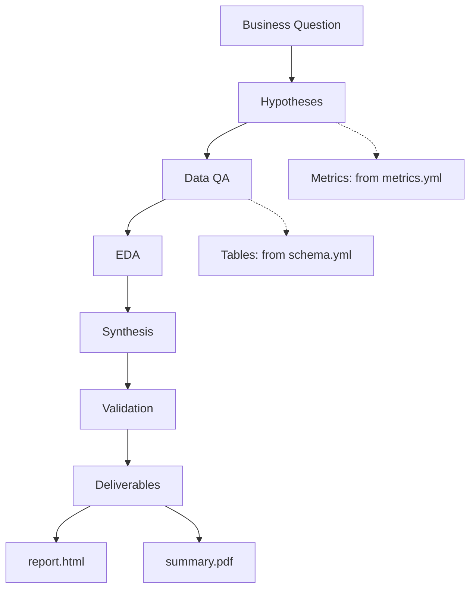

# Analysis Plan

> Copy this folder to `analyses/<slug>_<YYYY-MM-DD>_<analyst-name>/` to start a new analysis.
> Fill in every section below as you progress through the skills.

---

## Meta

- **Analyst:** <name>
- **Date started:** <YYYY-MM-DD>
- **Slug:** <kebab-case-slug>
- **Status:** In Progress / Complete / On Hold

---

## Question

<One-sentence restatement of the business question. Confirm with the user before proceeding.>

## Decision This Supports

<What action depends on the answer. If none, flag to the user.>

---

## Hypotheses

*Filled during hypothesis-framer phase.*

- **H1 (primary):** <statement>
  - Confirms if: <specific criterion>
  - Refutes if: <specific criterion>
- **H2 (alternative):** <statement>
  - Confirms if: <criterion>
  - Refutes if: <criterion>
- **H0 (null):** <what "nothing's going on" looks like>

---

## Required Data

- **Tables:** <list from schema.yml>
- **Metrics:** <list with definitions cited from metrics.yml>
- **Time window:** <start — end>
- **Segments:** <list>

## Scope

- **In:** <list>
- **Out:** <list>

---

## Flow Diagram

*Required. Replace the placeholder below with the actual flow for this analysis.*

---

## Checkpoint Log

*Append an entry after each phase when the user confirms advancement.*

### Hypothesis Framed — <YYYY-MM-DD HH:MM>
- **Summary:** <what was decided>
- **Artifacts:** this plan.md
- **User decision:** Approved / Revised / Paused
- **Notes:** <any direction-changing notes>

### Data QA Complete — <YYYY-MM-DD HH:MM>
- **Summary:** quality score, findings by severity
- **Artifacts:** `results/qa-report.md`, `results/qa-summary.json`
- **User decision:**
- **Notes:**

### EDA Complete — <YYYY-MM-DD HH:MM>
- **Summary:** key findings
- **Artifacts:** `results/eda-findings.md`, charts
- **User decision:**
- **Notes:**

### Synthesis Drafted — <YYYY-MM-DD HH:MM>
- **Summary:** headline conclusion, evidence per hypothesis
- **Artifacts:** `results/synthesis.md`
- **User decision:**
- **Notes:**

### Validation Complete — <YYYY-MM-DD HH:MM>
- **Summary:** which conclusions survived, which were narrowed
- **Artifacts:** `results/validation.md`, revised `synthesis.md`
- **User decision:**
- **Notes:**

### Deliverables Ready — <YYYY-MM-DD HH:MM>
- **Summary:** final answer, recommendations
- **Artifacts:** `deliverables/report.html`, `deliverables/summary.pdf`
- **User decision:** Accepted / Revised
- **Notes:**
