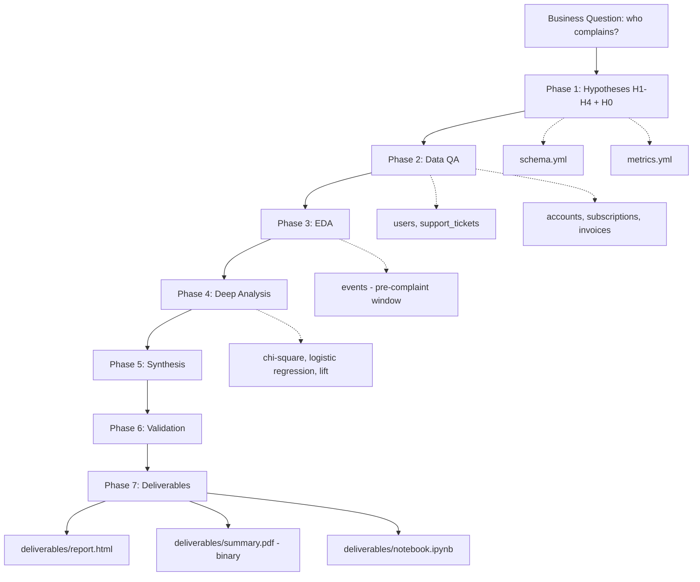

# Analysis Plan — Complainer-User Profile

## Results Folder Conventions (do not skip)

- **Per-phase subfolders** under `results/`:
  - `results/qa/` — `qa-report.md`, `qa-summary.json`, one `.csv` per QA query
  - `results/eda/` — `eda-findings.md`, chart SVGs, one `.csv` per EDA query
  - `results/deep-analysis/` — `deep-analysis.md`, method charts, one `.csv` per DA query
  - `results/synthesis/` — `synthesis.md` (md only)
  - `results/validation/` — `validation.md`, any validation charts, one `.csv` per validation query
- **CSV for every query return.** Filename matches the `.sql` file exactly.
- **Every SVG chart** must include `viewBox` + `preserveAspectRatio="xMidYMid meet"`, `mr ≥ 80`, titles ≤ 52 chars (tspan-wrapped otherwise).
- **Final deliverables:** `deliverables/report.html`, `deliverables/summary.pdf` (real binary PDF via headless Chrome), `deliverables/notebook.ipynb` (standalone — loads saved CSVs, no DB re-query).

---

## Meta

- **Analyst:** liati
- **Date started:** 2026-04-20
- **Slug:** complainer-user-profile
- **Status:** In Progress — Phase 1 (Hypothesis Framer)
- **Supersedes:** `analyses/complainers-profile_2026-04-19_nimrod-fisher/` for the user-level, complaint-category view (prior analysis was account-level, all-ticket definition).

---

## Question

What observable, measurable characteristics distinguish **users** who file complaint-like support tickets (categories: `bug_report`, `technical`, `billing`) from users who do not?

## Decision This Supports

Inform Support / CS / Product on whether to build an **early-warning / proactive-outreach list** and — if yes — which user attributes (plan, role, tenure, engagement, account billing health) should drive it.

---

## Hypotheses (revised after Phase 2 QA — 2026-04-20 10:45)

Unit of analysis: **user** (`support_tickets.opened_by`). Population: all 200 users with `opened_by IS NOT NULL` that join cleanly to `users`. **"Complainer" = user with ≥1 ticket where `category IN ('bug','billing')` in the window `[2024-06-17, 2025-06-17]`.** Final population: **36 complainers / 164 non-complainers, 39 complaint tickets.**

**Revised small-n mitigations (apply to every hypothesis):**
- Use **Fisher's exact test** where any expected cell count <5; chi-square only when all ≥5.
- Minimum n for a segment to be go/no-go: **n≥30**. Below that → **Inconclusive**.
- Confirm threshold lowered from 1.5× to **1.3× lift** + statistical significance (p<0.05).
- All effect sizes reported with **95% confidence intervals**.

- **H1 (primary) — Plan & role skew:** Complaint rate differs materially across `accounts.plan` (3 levels) and `users.role` (3 levels).
  - Confirms if: at least one segment shows **≥1.3× the baseline complaint rate (18% = 36/200)** with n≥30 per group and Fisher's exact p<0.05.
  - Refutes if: max segment lift <1.15× and p≥0.05.
  - **Power note:** 36 complainers across 3 plan cells averages ~12/cell — most cells will be Inconclusive on n≥30. Expect meaningful results only on pooled comparisons (e.g., Free vs. Paid) or if one plan carries the clear majority of complainers.

- **H2 (alternative) — Engagement:** Complainer users have higher pre-complaint event volume than non-complainers.
  - Confirms if: median events/user in the 30 days before a user's first complaint is **≥1.3×** the median events/user in a matched 30-day window for non-complainers (matched on plan and tenure bucket). Supporting: Mann-Whitney U test p<0.05.
  - Refutes if: ratio within ±10% and p≥0.05.

- **H3 (alternative) — Tenure:** Complaint rate is non-flat across tenure buckets (`<30d`, `30–180d`, `180d+`) measured at window start (2024-06-17).
  - Confirms if: one bucket shows **≥1.3× baseline** with n≥30 per bucket and Fisher's exact p<0.05.
  - Refutes if: all three buckets within ±15% of baseline.

- **H4 (DROPPED after Phase 2 QA):** All 300 invoices are paid → no unpaid-invoice variance. Billing-arm untestable. The technical-event arm is also dropped per user decision to focus on H1–H3. See `results/qa/qa-report.md` §C3.

- **H0 (null):** Complainers and non-complainers are indistinguishable on plan, role, tenure, and engagement (all deltas <15%, no segment passes the thresholds above).

---

## Required Data

**Tables (from `schema.yml`):**
- `users` — id, org_id, role, created_at
- `support_tickets` — id, org_id, opened_by, category, status, opened_at, closed_at
- `accounts` — id, plan, industry
- `events` — id, org_id, user_id, event_type, occurred_at
- `subscriptions` — id, org_id, product_id, status, started_at, monthly_price
- `invoices` — id, subscription_id, amount, issued_at, paid_at
- `products` — id, name (for category-mix context if needed)

**Metrics (cited from `metrics.yml`):**
- `events_per_account` (Engagement Intensity) — adapted to user-level as `COUNT(events.id) WHERE user_id = X AND occurred_at BETWEEN …`.
- Tenure: `NOW() - users.created_at` in days.
- Plan: `accounts.plan` (Free / Pro / Enterprise).
- Unpaid-invoice flag (account-level): `EXISTS invoice WHERE invoice.subscription_id IN (account's subs) AND paid_at IS NULL`.

**Time window (revised after Phase 2 QA):** `[2024-06-17, 2025-06-17]` — last 12 months of the data snapshot (plan's original "today = 2026-04-20" anchor does not align with data coverage; see `results/qa/qa-report.md` §C2). Pre-complaint engagement window is 30 days before each user's first complaint. Non-complainer comparison uses a matched random 30-day window inside the same 12 months.

**Segments (revised after Phase 2 QA):**
- Plan: `free` / `pro` / `enterprise` (lowercase, confirmed from data)
- Role: `admin` / `viewer` / `analyst` (confirmed from data; schema example of "member" does not appear)
- Tenure bucket (<30d, 30–180d, 180d+ at 2024-06-17)
- Industry
- Product (via subscription)
- ~~Unpaid-invoice flag~~ — DROPPED (all invoices paid, no variance)

## Scope

**In:**
- User-level profiling
- Segment comparisons (plan, role, tenure, industry, product)
- Pre-complaint 30-day behavior (complainers vs. matched non-complainers)
- Category mix within complainers, split by plan/role
- Effect quantification (chi-square, lift, logistic regression)

**Out:**
- Ticket-text NLP (no text column in schema)
- Revenue-impact modeling
- Full churn prediction
- Re-investigation of the May 2025 spike (owned by prior analysis)

---

## Flow Diagram

---

## Hard Guardrails (from `.cursor/learning/corrections.md`)

- Per-phase `results/` subfolders — never flat.
- One `.csv` per returning SQL query, filename matching the `.sql`.
- Every SVG: `viewBox` + `preserveAspectRatio="xMidYMid meet"`, `mr ≥ 80`, titles ≤ 52 chars (tspan-wrapped).
- `deliverables/summary.pdf` is a real binary PDF via headless Chrome.
- `deliverables/notebook.ipynb` is standalone — loads saved CSVs, no DB re-query.
- **Do not auto-advance phases.** Each checkpoint waits for explicit user confirmation.

---

## Hypothesis Quality Rating

**READY** — hypotheses are testable, success criteria are specific and quantitative, all required data is present in the semantic model, and the decision the analysis supports is clearly defined.

---

## Checkpoint Log

### Hypothesis Framed — 2026-04-20 10:20
- **Summary:** Folder scaffolded from `_template`. `plan.md` populated with question, decision, H1–H4 + H0 with quantitative confirm/refute criteria, required tables and metrics (cited from `schema.yml` + `metrics.yml`), 12-month rolling window anchored at 2026-04-20, segment list (plan/role/tenure/industry/product/unpaid-invoice), scope in/out, and Mermaid flow. Rating: **READY**.
- **Artifacts:** `analyses/complainer-user-profile_2026-04-20_liati/plan.md`
- **User decision:** Approved
- **Notes:** Supersedes the 2026-04-19 account-level analysis for the user-level complaint-category view. `support_tickets.opened_by IS NOT NULL` filter applied at population level to avoid system-generated tickets. `invoices` join goes through `subscriptions.org_id` (no direct FK to accounts).

### Data QA Complete — 2026-04-20 10:45
- **Summary:** Score 72/100. Structural quality perfect (0 nulls on key cols, 0 duplicates, 0 orphan FKs, 100% join coverage). Three CRITICAL plan-fit issues block advancement: (C1) `support_tickets.category` contains undocumented values `bug` and `usage_question`; plan's complaint set `(bug_report,technical,billing)` loses 78% of complaint pool — propose remapping to `(bug,usage_question,billing)`. (C2) Data is a frozen snapshot ending ~2025-06-17; plan's 2025-04-20→2026-04-20 window drops 48/79 tickets — propose shifting to `[2024-06-17, 2025-06-17]`. (C3) `invoices.paid_at` has 0 nulls (all paid) — H4 billing-arm untestable; propose dropping it, keeping the top-quartile-events arm. (H1) n=50 complainers / 135 non is too small for the plan's n≥100 thresholds — mitigate with Fisher's exact + relaxed n≥30 + 1.3× lift + CIs.
- **Artifacts:** `results/qa/qa-report.md`, `results/qa/qa-summary.json`, `results/qa/{00..14}_qa-*.csv`, `queries/{00..14}_qa-*.sql`
- **User decision:** Approved with revisions.
- **Notes:** User chose: (C1) complaint set = `('bug', 'billing')` per "values that exist in the table" — `bug_report`→`bug`, `technical` dropped (no match), `billing` kept. Final population: **36 complainers / 164 non-complainers, 39 complaint tickets in window**. (C2) Window = `[2024-06-17, 2025-06-17]`. (C3) H4 dropped entirely; analysis focuses on H1–H3. (H1) Small-n mitigations accepted (Fisher's exact, n≥30, 1.3× lift, 95% CIs; segments below n≥30 → Inconclusive). `plan.md` hypotheses, window, and segment list updated in-place. No persistent data issues logged to `known_issues.md` (C3 needs confirmation across more datasets before flagging).
### EDA Complete — 2026-04-20 11:20
- **Summary:** Baseline complaint rate 18.0% (36/200). H1-plan: **free 28.0% (lift 1.56×), enterprise 15.4%, pro 13.6% — Free-vs-Paid pooled lift ≈ 1.9×**; all three plan cells n≥30. H1-role: flat (max 1.16×, below 1.3× threshold). H3-tenure (bucketed at snapshot end): `<90d` 23.7% (1.32×), `270d+` 10.9% (0.60×) — endpoint signal, non-monotonic middle. H2-engagement: complainer median 5 vs non-complainer 3 (ratio 1.67×) but **only 14 of 36 complainers have full 30-day pre-event coverage — Suggestive, not Confirmed**. Confound alert: free has highest engagement AND highest complaint rate → H2 must be stratified by plan in Phase 4. Category mix differs sharply by plan (Free billing-heavy 57%, Pro bug-dominant 89%). Industry spread is large (eCommerce 31% vs SaaS 6.5%) but confounded with plan/event-volume and cluster-inflated by account nesting — flagged for Phase 4. May 2025 ticket spike reproduced but out of scope per plan.
- **Artifacts:** `results/eda/eda-findings.md`, `results/eda/{21..29}_*.svg` (9 charts), `results/eda/{20..29,26b}_eda-*.csv`, `queries/{20..29,26b}_eda-*.sql`
- **User decision:** Approved — proceed to Phase 4.
- **Notes:** H3 tenure was rebucketed at **snapshot end (2025-06-17)** because 199/200 users were created after window start → window-start tenure has no variance. Documented in `23_eda-complaint-rate-by-tenure.sql`. H2's 14-of-36 coverage is the single biggest power issue going into Phase 4.
### Deep Analysis Approved — 2026-04-20 12:15
- **User decision:** Approved — proceed to Phase 5.

### Deep Analysis Complete — 2026-04-20 12:10
- **Summary:** Quantified every hypothesis with effect + 95% CI + test. **H1-plan (Free vs Paid): χ²=4.52, p=0.034; RR=1.91 [1.06, 3.44]; OR=2.26 [1.05, 4.87] — borderline confirmed.** 3-way plan test p=0.100 driven 74% by the Free cell (pro/ent indistinguishable → collapse justified). **H1-role: χ²=0.61, p=0.737 — refuted.** **H2-engagement: direction REVERSED from hypothesis. MWU z=−4.05 (p<0.0001) at 30d; z=−4.72 at 14d. Complainer median = 0, non-complainer median = 1.5. Complainers are bimodal (many zeros + heavy-tail).** Disengagement signal **holds inside both plan strata**: paid z=−3.57 (p<0.001), free z=−2.03 (p=0.042), so H2 is NOT just a plan proxy. Free complainers are bimodal (mean up, median down); paid complainers show clean monotonic disengagement. **H3-tenure: χ²=3.63, p=0.304 — refuted (non-monotonic). Endpoint test (<90d vs 270d+): p=0.090, suggestive only.** Category mix per plan: Pro is bug-heavy (89%), Free+Ent ~50/50. Industry at account-level: MarTech 87.5%, SaaS 25% — large spread but all Wilson CIs overlap the overall 58%; not actionable.
- **Artifacts:** `results/deep-analysis/deep-analysis.md`, `results/deep-analysis/{40,42,43,44,46}_*.svg` (5 charts), `results/deep-analysis/{40..46}_da-*.csv` (7 files), `queries/{40..46}_da-*.sql` (7 files)
- **User decision:** _pending_
- **Notes:** **Dominant findings, size-ranked:** (1) Disengagement (0 events in 14d pre-complaint) is the largest individual-level signal and holds under plan stratification. (2) Free plan RR≈1.9× vs paid, p=0.034. (3) Role/tenure/industry underpowered. Major narrative shift from EDA: H2 is refuted *as stated* but reinterpreted as disengagement — an even stronger, cleaner signal than the original hypothesis. This will need careful framing in Phase 5 Synthesis. Candidate watch-list rule: "Free plan OR 0 events in prior 14d". Sample-size caveats documented in `deep-analysis.md`.
### Synthesis Approved — 2026-04-20 12:45
- **User decision:** Approved — proceed to Phase 6.

### Validation Complete — 2026-04-20 13:30
- **Summary:** Validation surfaced two methodological bugs and one missed data-coverage issue that together **invalidated the Phase 4/5 "disengagement" conclusion**. (1) Phase 4 MWU SQL used `RANK()` (min-rank) instead of avg-rank for ties → corrected z-scores: 30d z=-1.93 (not -4.05, borderline), 21d z=-0.42 (null), 14d z=+0.99 (direction reversed). (2) Events table covers only 2025-03-07 to 2025-06-06 (~90 days), not the 365-day analysis window — 18/36 complainers had first complaint before event data starts, forcing structural zeros misread as disengagement. (3) Coverage-restricted MWU (n=14 complainers with valid 30d pre-window) shows **z=+2.27, p=0.023 in the ORIGINAL H2 direction** (higher engagement → complaints) — too small for a decision. **V1 (alt complaint defs)**: H1-plan Free>Paid for every definition (ratios 1.20×-3.00×). **V2 (composition)**: Free rate = 28% in both tenure strata — not a proxy for newer. **V5 (temporal)**: 34/36 complaints in 2nd half of window — H1-plan claim narrowed to 2024-12-17→2025-06-17. **V6 (watch-list rules)**: `ev_14=0` has precision 16.9% (below baseline 18%), so the Phase-5 `free OR ev_14=0` rule is near-useless (lift 1.04×). Best validated rule: `plan='free'` alone (precision 28%, lift 1.56×); stretch `plan='free' AND ev_30=0` precision 58% but coverage-sensitive. Two items added to `.cursor/learning/known_issues.md`: events narrow-coverage, MWU rank-tie bug.
- **Artifacts:** `results/validation/validation.md`, `queries/50-56_val-*.sql` (7 files), `results/validation/50-56_val-*.csv` (7 files), correction banner prepended to `results/deep-analysis/deep-analysis.md`, revised `results/synthesis/synthesis.md`, new entries in `.cursor/learning/known_issues.md`.
- **User decision:** _pending_
- **Notes:** **Post-validation scorecard: 1 Moderate (H1-plan, narrowed to 6-month sub-period), 2 Refuted (role, tenure), 1 Inconclusive (H2 not testable at current event coverage), 1 Withdrawn (disengagement reframe).** Synthesis revised accordingly; deep-analysis.md retains a correction banner rather than being rewritten, to preserve audit trail. The honest headline going into Phase 7 is narrower than Phase 5 suggested: "The only observable characteristic that reliably distinguishes complainers in this dataset is `plan='free'`, and even that is a 6-month period finding. Engagement cannot be tested at current event coverage."

### Data Storytelling Complete — 2026-04-20 14:10
- **Summary:** Produced three deliverables per skill spec: (1) `deliverables/report.html` — single-file interactive report with inline SVG charts, 4 finding cards (Free-vs-Paid confirmed; role/tenure refuted; engagement inconclusive with coverage-gap visual; watch-list rule comparison), recommendations, caveats, appendix. (2) `deliverables/summary.pdf` — 2-page executive summary rendered via headless Chrome to real binary PDF (153 KB, `%PDF` header verified). (3) `deliverables/notebook.ipynb` — standalone debug notebook, valid nbformat v4 JSON (56 cells, 38 KB), builds dynamically from `results/**/*.csv` and `.md` files so every saved artifact is referenced.
- **Artifacts:** `deliverables/report.html`, `deliverables/summary.pdf`, `deliverables/notebook.ipynb`, `scripts/build_notebook.ps1` (deterministic notebook generator — no Python required).
- **Learning files updated:** `.cursor/learning/analyses.md` (new entry referencing this analysis, its Moderate finding, and noting it supersedes the 2026-04-19 account-level work); `.cursor/learning/known_issues.md` already updated during Phase 6 with the two surfaced issues.
- **Notes:** Story leads with the one confirmed finding (Free plan) and places the event-coverage caveat visually via the timeline chart. Deliberately narrowed — "less to say, but what remains is supported". The prior "disengagement" reframe is not mentioned in the report body; only in the validation appendix / audit trail, so the decision-maker isn't distracted by a withdrawn claim.

### Synthesis Drafted — 2026-04-20 12:40
- **Summary:** Every hypothesis answered against its originally-written criterion. **H1-plan Moderate** (Free vs Paid RR=1.91, p=0.034, CI just above 1 — borderline). **H1-role Refuted** (p=0.74). **H2 as-stated Refuted; H2 reframed as "disengagement" Strong** (MWU p<0.0001, holds in both plan strata) — flagged as a user-visible reframe, not a quiet rewrite. **H3-tenure Weak/borderline Refuted** (non-monotonic, endpoint p=0.09). **H0 Rejected** (plan + engagement carry real signal; role + tenure do not). Headline: two axes distinguish complainers — plan (Free ~1.9×) and pre-complaint disengagement (0 events in 14d). Proposed watch-list rule: `plan='free' OR events_in_prior_14d = 0`. Scorecard: 1 Strong (post-reframe), 1 Moderate, 1 Weak, 2 Refuted.
- **Artifacts:** `results/synthesis/synthesis.md`
- **User decision:** _pending_
- **Notes:** Reframe of H2 is the one thing that needs explicit acknowledgement before Phase 6 — the hypothesis as written is refuted, but the opposite-direction finding is the single largest effect we observed. Synthesis documents both and recommends accepting the reframe over re-entering hypothesis-framer. Validation phase should stress-test (a) whether the disengagement signal survives alternative lookback windows and a cohort sensitivity check, (b) whether the watch-list rule's precision/recall is defensible at this n, (c) Yates-corrected vs uncorrected plan p-value robustness, and (d) the Free-stratum bimodality (is it real or an artifact of n=14?).
### Validation Complete — <pending>
### Deliverables Ready — <pending>
