# Analysis Plan

> Analysis folder: `analyses/complainers-profile_2026-04-19_nimrod-fisher/`

---

## Meta

- **Analyst:** Nimrod Fisher
- **Date started:** 2026-04-19
- **Slug:** complainers-profile
- **Status:** In Progress

---

## Question

What characteristics (plan, tenure, engagement level, and behavioral signals) distinguish accounts that open support tickets from those that do not?

## Decision This Supports

Prioritize proactive customer success outreach — specifically, identify which account segments to target *before* they complain, so support volume and churn risk can be reduced.

---

## Hypotheses

*Framed during hypothesis-framer phase — criteria set before data is examined.*

- **H1 (primary):** Complaining accounts have higher platform engagement (more events) than non-complaining accounts — power users encounter more edge cases and report them.
  - Confirms if: median event count for complaining accounts is ≥1.5× that of non-complaining accounts, with n ≥ 100 complainers.
  - Refutes if: median event counts are within ±20% of each other.

- **H2 (alternative):** Complaining accounts are disproportionately concentrated on specific subscription plan tiers (e.g., Free or Enterprise have higher complaint rates than mid-tier accounts).
  - Confirms if: complaint rate (tickets_per_account) in the highest-complaint tier is ≥2× the overall complaint rate, with n ≥ 50 per tier.
  - Refutes if: complaint rate is within ±25% of average across all major tiers.

- **H3 (alternative):** Complaints are concentrated in specific account tenure buckets — new accounts (< 90 days) hit onboarding friction; long-tenure accounts (> 2 years) accumulate technical debt.
  - Confirms if: complaint rate in the highest-complaint tenure bucket is ≥1.5× the overall average, with n ≥ 50 per bucket.
  - Refutes if: complaint rate is flat across all tenure buckets (within ±20%).

- **H4 (alternative):** Complaining accounts show behavioral pre-signals — a spike in event volume or a sharp drop in event frequency in the 30 days before their first ticket.
  - Confirms if: 30-day pre-ticket event count is ≥1.5× or ≤0.5× the same account's 30-day baseline, in ≥40% of complaining accounts.
  - Refutes if: pre-ticket event trajectory is indistinguishable from baseline for >80% of complainers.

- **H0 (null):** Complaining accounts are statistically indistinguishable from non-complaining accounts across plan, tenure, engagement, and ticket category dimensions.
  - Confirms if: no dimension produces a complaint rate difference of ≥1.5× the overall rate with n ≥ 50.

---

## Required Data

- **Tables:**
  - `support_tickets` — the complaint signal; links to accounts via `org_id`; `opened_at` for timing; `category` for complaint type; `status` for resolution
  - `accounts` — plan tier (`plan`), account tenure (`created_at`), industry
  - `events` — engagement signal; event counts per `org_id` and `occurred_at`
  - `subscriptions` — subscription status, `monthly_price` for revenue segmentation, `started_at`

- **Metrics (from metrics.yml):**
  - `support_volume` — COUNT(support_tickets.id) per account
  - `events_per_account` (engagement intensity) — COUNT(events.id) per org_id
  - Account tenure — DATE_PART('day', NOW() - accounts.created_at)

- **Time window:** All available data; focus complaint analysis on `support_tickets.opened_at`. No fixed cutoff until we see date coverage in QA.

- **Segments:**
  - Plan tier (accounts.plan)
  - Account tenure buckets: 0–90 days, 91–365 days, 1–2 years, >2 years
  - Ticket category (billing, technical, feature_request, bug_report, etc.)
  - Industry (if cardinality is reasonable)

---

## Scope

- **In:**
  - Account-level complainer vs. non-complainer profile
  - Plan tier, tenure, engagement (event volume) dimensions
  - Ticket category breakdown
  - Pre-complaint behavioral signal (event trajectory before first ticket)

- **Out:**
  - Individual user-level profiling (analysis is at account/org level — `support_tickets` links to `org_id`, not `user_id`)
  - Revenue impact / churn prediction modeling
  - Attribution to specific product changes or outages (no event changelog in schema)
  - Geographic segmentation (no geography column in schema)

---

## Flow Diagram

```mermaid
flowchart TD
    Q["Business Question: What characterizes complaining accounts?"]
    SM["Semantic model loaded: schema.yml + metrics.yml"]
    PF["Phase 1: Hypothesis Framer ✓\nH1 (engagement) · H2 (plan) · H3 (tenure) · H4 (pre-signal) · H0 (null)"]
    CP1{"Checkpoint 1\nApproved?"}
    QA["Phase 2: Data QA\nsupport_tickets · accounts · events · subscriptions\nCompleteness · uniqueness · join coverage · date range"]
    CP2{"Checkpoint 2\nScore ≥ 70?"}
    EDA["Phase 3: EDA\nUnivariate · Bivariate by plan/tenure\nPre-signal trajectory · Category breakdown"]
    CP3{"Checkpoint 3\nApproved?"}
    SYN["Phase 4: Synthesis\nMap evidence to H1–H4 + H0\nRate strength · Write answers"]
    CP4{"Checkpoint 4\nApproved?"}
    VAL["Phase 5: Validation\nSensitivity · Alternatives · Red-team"]
    CP5{"Checkpoint 5\nApproved?"}
    DS["Phase 6: Data Storytelling\nreport.html + summary.pdf"]
    DONE["Analysis Complete\nUpdate learning files"]

    Q --> SM --> PF --> CP1
    CP1 -->|"Approved"| QA --> CP2
    CP2 -->|"Score ≥ 70"| EDA --> CP3
    CP3 -->|"Approved"| SYN --> CP4
    CP4 -->|"Approved"| VAL --> CP5
    CP5 -->|"Approved"| DS --> DONE
    CP1 -->|"Needs work"| PF
    CP2 -->|"CRITICAL issues"| QA
```

---

## Checkpoint Log

### Hypothesis Framed — 2026-04-19

- **Summary:** 5 hypotheses covering engagement (H1), plan tier (H2), tenure (H3), pre-complaint signal (H4), and null (H0). Analysis unit is account (org), not individual user. Scope excludes geography, revenue modeling, individual user profiling.
- **Artifacts:** `plan.md`
- **User decision:** Approved (proceeding per analyst instruction)
- **Notes:**
  - `support_tickets` has no direct `user_id` complaint field; `opened_by` is nullable — complaint analysis is org-level
  - No geography column in schema; H4 (pre-signal) requires event time-series join and is the most complex hypothesis

### Data QA Complete — (pending)

### EDA Complete — (pending)

### Synthesis Drafted — (pending)

### Validation Complete — (pending)

### Deliverables Ready — (pending)
