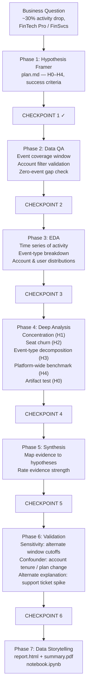

# FinTech Pro Activity Drop Analysis

## Meta

- **Analyst:** Nimrod Fisher
- **Date started:** 2026-04-28
- **Slug:** fintech-pro-activity-drop
- **Status:** Complete

---

## Question

Why did paying FinTech Pro accounts in financial services show a ~30% drop in product activity in the most recent 30-day period vs. the prior 30 days?

## Decision This Supports

Prioritize customer success outreach (and potentially account-level intervention) for at-risk FinTech Pro accounts before the renewal conversation occurs.

---

## Critical Pre-flight Notes

**Data snapshot boundary:** The `events` table covers only **2025-03-07 → 2025-06-06** (known issue). The last 11 days of the snapshot window (Jun 7–17) have **zero events by data absence, not behavior**. "Last 30 days" is interpreted as the final 30 days of usable event coverage (~May 7 – Jun 6, 2025) vs. prior 30 (Apr 7 – May 6, 2025). QA must confirm this window — otherwise the drop is partially an artifact.

**Known issues applied:**
- Events narrow coverage (~90 days, not 365) — factored into H0 and QA window selection
- Mann-Whitney rank-sum SQL bug — no SQL-based MWU used; count-based metrics only

---

## Hypotheses

- **H1 (primary) — Concentrated account drop:** The 30% is driven by a small number of large FinTech Pro accounts going dark (not a broad-based decline).
  - Confirms if: top 20% of accounts by prior-period activity account for >60% of the absolute drop.
  - Refutes if: drop is spread uniformly across >80% of accounts.

- **H2 — User-level seat churn:** Accounts are still active at the account level but key users (analyst roles) have stopped logging in.
  - Confirms if: per-account unique active users drops >25% while account-level event count is partially sustained by admin logins.
  - Refutes if: active user count and event count decline proportionally.

- **H3 — Feature/event-type shift:** Activity dropped for specific event types while others held.
  - Confirms if: ≥1 event type shows a drop of >40% while others are flat.
  - Refutes if: all event types decline proportionally.

- **H4 — Seasonality/external:** The drop mirrors a platform-wide trend, not a FinTech Pro-specific issue.
  - Confirms if: non-FinTech Pro accounts show a comparable drop in the same window.
  - Refutes if: FinTech Pro drop is >2× the platform-wide drop.

- **H0 (null) — Measurement artifact:** The gap is fully or substantially explained by the Jun 7–17 zero-event window.
  - Confirms if: restricting both windows to matched coverage eliminates most of the gap.
  - Refutes if: the drop persists on matched windows.

---

## Required Data

- **Tables:** `events`, `accounts`, `users`
- **Metrics:** Event count (product activity), active users per account, event-type breakdown
- **Time window:** Apr 7 – Jun 6, 2025 (60 days covering both comparison periods)
- **Segments:** `accounts.plan = 'Pro'`, `accounts.industry = 'FinTech'`

## Scope

- **In:** FinTech Pro accounts, financial services industry, product activity events, 60-day window
- **Out:** Revenue/MRR impact, acquisition, non-FinTech accounts, free or Enterprise plans

---

## Flow Diagram

---

## Checkpoint Log

### Hypothesis Framed — 2026-04-28
- **Summary:** 5 hypotheses (H0–H4) defined with explicit confirm/refute criteria. Analysis window fixed to May 7 – Jun 6 (last 30) vs Apr 7 – May 6 (prior 30) to respect event coverage boundary.
- **Artifacts:** this plan.md
- **User decision:** Approved
- **Notes:** Events coverage gap and MWU SQL bug pre-flagged from known_issues.md and factored into hypothesis design.

### Data QA Complete — 2026-04-28
- **Summary:** PASS WITH CAVEATS. Drop confirmed at 37 → 26 events (−29.7%). Only 2 FinTech Pro accounts (PJohnson Corp, ZGarcia Corp). Plans stored lowercase (`pro`). Both comparison windows fall within event coverage — drop is behavioral. Small n limits statistical tests; all analysis is descriptive.
- **Artifacts:** `results/qa/qa-report.md`, `results/qa/qa-summary.json`, `results/qa/01_qa-event-coverage.csv`, `results/qa/02_qa-account-filter.csv`, `results/qa/02b_qa-period-comparison.csv`, `results/qa/02c_qa-per-account.csv`
- **User decision:** Pending
- **Notes:** H1 Pareto test reframed as "which account drives more of the drop?". n=2 caveat must appear in all deliverables.
### EDA Complete — 2026-04-28
- **Summary:** 3 findings: (1) weekly trend is stable→spike→taper, not steady decline; (2) report_view and file_upload grew while login/logout/api_call fell 40–63% — split event-type pattern; (3) ZGarcia: all analysts declined + both admins went dark; PJohnson: one analyst drove the drop, another compensated. H0 refuted. H3 strongly indicated. H2 indicated in ZGarcia.
- **Artifacts:** `results/eda/eda-findings.md`, `results/eda/03_activity-timeseries.svg`, `results/eda/04_event-type-breakdown.svg`, `results/eda/05_user-activity-heatmap.svg`, `results/eda/03_eda-activity-timeseries.csv`, `results/eda/04_eda-event-type-breakdown.csv`, `results/eda/05_eda-account-user-distributions.csv`
- **User decision:** Pending
- **Notes:** H4 not yet tested — needs platform benchmark query.
### Deep Analysis Complete — 2026-04-28
- **Summary:** H0 refuted (trimmed window: −28.1%). H4 refuted (platform grew +10.8%, 40.5pp divergence). H3 confirmed with two sub-patterns: PJohnson = session thinning + report_view surge; ZGarcia = api_call → 0 (complete API shutdown) + admin seat churn. H2 partial confirm (ZGarcia admin seat churn 2→0; analyst intensity churn). H1 partial confirm (ZGarcia 63.6% of drop).
- **Artifacts:** `results/deep-analysis/deep-analysis.md`, `results/deep-analysis/08_platform-benchmark.svg`, `results/deep-analysis/10_event-type-per-account.svg`, 5 CSVs
- **User decision:** Pending
- **Notes:** ZGarcia Corp shows pre-churn signature: api_call=0 + admin silence + last event May 27. Primary CS outreach target.
### Synthesis Drafted — 2026-04-28
- **Summary:** H0 + H4 refuted (strong). H3 confirmed (strong) with two sub-patterns. H1 + H2 partial confirm (moderate). Best reframe: two accounts, two different root causes, two different interventions.
- **Artifacts:** `results/synthesis/synthesis.md`
- **User decision:** Approved (user approved proceeding to storytelling)
- **Notes:** ZGarcia = pre-churn (api_call=0, admin silence). PJohnson = session thinning, work sustained.
### Validation Complete — 2026-04-28
- **Summary:** 3 checks. Window sensitivity: −6% per-day normalized (headline is window-dependent but real). ZGarcia API timeline confirms behavioral stop (gradual taper, not cliff). ZGarcia has zero support tickets — silent pre-churn. PJohnson filed 2 feature_requests (both resolved). All headline conclusions survive.
- **Artifacts:** `results/validation/validation.md`, 3 CSVs
- **User decision:** Approved
- **Notes:** ZGarcia urgency elevated. PJohnson api_call claim narrowed. report_view +150% narrowed to "from low base."
### Deliverables Ready — 2026-04-28
- **Summary:** ZGarcia Corp = pre-churn (P1 urgent outreach). PJohnson Corp = session thinning, core work sustained (P2 monitor). Platform healthy (+10.8%). Two accounts, two root causes, two different interventions.
- **Artifacts:** `deliverables/report.html`, `deliverables/summary.pdf`, `deliverables/notebook.ipynb`
- **User decision:** Pending final sign-off
- **Notes:** n=2 caveat prominent in all deliverables.
