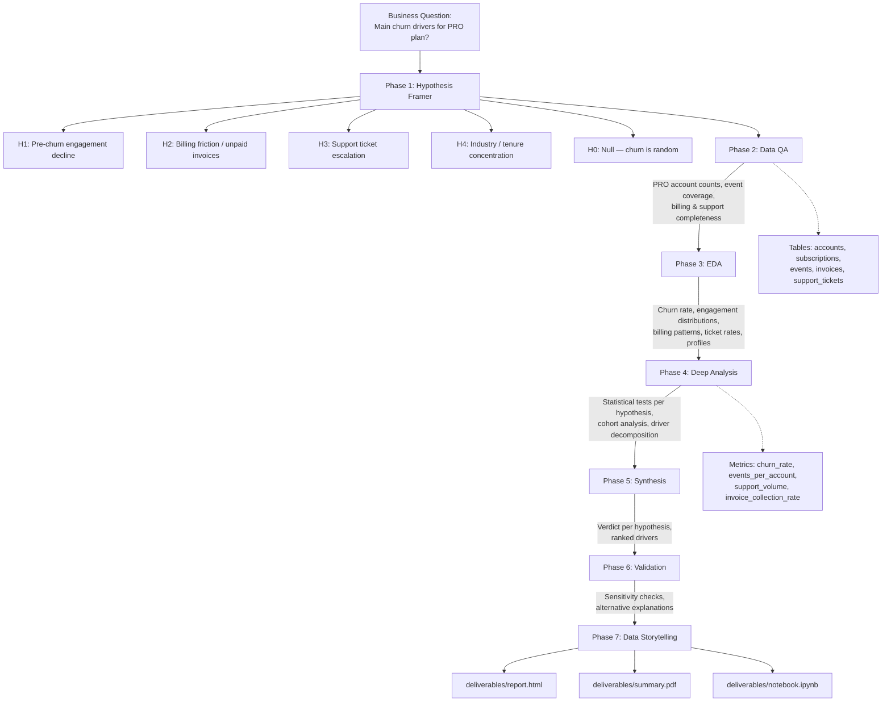

# Analysis Plan

---

## Results Folder Conventions (do not skip)

- **Per-phase subfolders** under `results/` — never a flat layout:
  - `results/qa/` — `qa-report.md`, `qa-summary.json`, one `.csv` per QA query
  - `results/eda/` — `eda-findings.md`, chart SVGs, one `.csv` per EDA query
  - `results/deep-analysis/` — `deep-analysis.md`, method charts, one `.csv` per DA query
  - `results/synthesis/` — `synthesis.md` (md only)
  - `results/validation/` — `validation.md`, any validation charts, one `.csv` per validation query
- **CSV for every query return.** Filename matches the `.sql` file exactly (e.g., `04_eda-engagement.sql` → `results/eda/04_eda-engagement.csv`).
- **Every SVG chart** must include `viewBox` + `preserveAspectRatio="xMidYMid meet"` so it scales without clipping in `report.html` and `summary.pdf`.
- **Final deliverables:** `deliverables/report.html`, `deliverables/summary.pdf`, `deliverables/notebook.ipynb`.

---

## Meta

- **Analyst:** Nimrod Fisher
- **Date started:** 2026-06-03
- **Slug:** pro-plan-churn-drivers_2026-06-03_nimrod-fisher
- **Status:** Complete

---

## Question

What are the main drivers of subscription cancellation among PRO plan accounts at Pulseboard?

## Decision This Supports

Prioritize and design retention interventions (CS outreach triggers, product fixes, pricing adjustments, onboarding improvements) for the PRO plan segment by identifying which factors most strongly predict churn.

---

## Hypotheses

- **H1 (primary — engagement decline):** PRO accounts that churned showed measurably lower product event activity in the 30–60 days before cancellation compared to retained PRO accounts over the same period.
  - Confirms if: mean events/30d for churned PRO accounts is ≤ 50% of retained PRO accounts in the same window, OR the difference is statistically significant (p < 0.05) with a meaningful effect size.
  - Refutes if: pre-cancellation event activity for churned PRO accounts is within ±20% of retained accounts, or the difference is not statistically significant.
  - **Caveat:** Events table covers only 2025-03-07 to 2025-06-06. Only PRO accounts with `canceled_at` between 2025-04-06 and 2025-06-06 are testable for H1 (30-day pre-window). Accounts outside this range will be flagged and excluded from H1 comparisons.

- **H2 (alternative — billing friction):** Churned PRO accounts have a higher rate of unpaid or late invoices before cancellation, indicating price sensitivity or billing issues as a driver.
  - Confirms if: ≥ 30% of churned PRO accounts had at least one unpaid invoice vs. < 10% of retained, OR the unpaid invoice rate is ≥ 2× higher in churned accounts.
  - Refutes if: unpaid invoice rates are within ±10 percentage points between churned and retained PRO accounts.

- **H3 (alternative — support escalation):** Churned PRO accounts filed significantly more bug or billing support tickets in the 90 days before cancellation.
  - Confirms if: mean support tickets/account in churned PRO is ≥ 1.5× retained PRO, with χ² or MWU p < 0.05.
  - Refutes if: ticket rate is within ±25% between groups.

- **H4 (alternative — industry or tenure concentration):** Churn concentrates in specific industries or short-tenure account cohorts (< 6 months), suggesting product-market fit gaps rather than a post-adoption issue.
  - Confirms if: one industry or tenure cohort accounts for ≥ 40% of churned PRO accounts while representing < 25% of the PRO base.
  - Refutes if: churn is distributed proportionally across industries and tenure cohorts (no segment > 1.5× its expected share).

- **H0 (null):** Churned PRO accounts are statistically indistinguishable from retained PRO accounts across engagement, billing, support, and profile dimensions — churn is random or externally driven.
  - Evidence for H0: All comparisons yield p > 0.1 and effect sizes < 0.2, with no segment concentration.

---

## Required Data

- **Tables:**
  - `accounts` — plan, industry, created_at, account name
  - `subscriptions` — status, started_at, canceled_at, monthly_price (PRO plan filter)
  - `events` — org_id, event_type, occurred_at (engagement proxy; coverage limited to 2025-03-07–2025-06-06)
  - `invoices` — subscription_id, amount, issued_at, paid_at (billing friction)
  - `support_tickets` — org_id, category, opened_at, closed_at, status (support escalation)

- **Metrics (from metrics.yml):**
  - `churn_rate` — COUNT(canceled) / COUNT(active+canceled) for PRO segment
  - `events_per_account` — Engagement Intensity: COUNT(events) per account per 30d window
  - `support_volume` — COUNT(support_tickets) per account
  - `mttr_days` — AVG(closed_at - opened_at) for PRO churned accounts
  - Invoice collection rate (derived) — COUNT(paid_at IS NOT NULL) / COUNT(*) per account

- **Time window:**
  - Subscription history: full history (no date cutoff for profile/billing analysis)
  - Events: 2025-03-07 to 2025-06-06 (hard constraint from known_issues.md)
  - Support tickets: full history available

- **Segments:**
  - Primary: `plan = 'Pro'`, `status = 'canceled'` (churned) vs `status = 'active'` (retained)
  - Secondary: by industry, by tenure cohort (< 6 months, 6–12 months, > 12 months)

---

## Scope

- **In:**
  - PRO plan accounts only (churned vs. retained)
  - Churn drivers: engagement, billing, support, industry/tenure profile
  - Temporal pattern: monthly churn counts over available history
- **Out:**
  - Revenue/MRR impact of churn (follow-up analysis)
  - Acquisition channel analysis (not in scope for retention focus)
  - Predictive model building (descriptive analysis only)
  - Free and Enterprise plans (separate questions)

---

## Known Data Caveats

1. **Events narrow window:** Coverage is 2025-03-07 to 2025-06-06 (~90 days). H1 engagement analysis is restricted to accounts with `canceled_at` in [2025-04-06, 2025-06-06]. Accounts outside this range are excluded from H1; their exclusion is flagged and quantified in QA.
2. **Mann-Whitney tie bug:** Any rank-sum tests must use avg-rank workaround: `avg_rank = ((COUNT(*) WHERE x < me.x) + 1 + (COUNT(*) WHERE x <= me.x)) / 2.0`. Do not use `RANK() OVER` directly for MWU.

---

## Flow Diagram

---

## Checkpoint Log

### Hypothesis Framed — 2026-06-03
- **Summary:** 4 testable hypotheses framed (engagement decline, billing friction, support escalation, industry/tenure concentration) plus explicit null. Events coverage caveat applied upfront — H1 restricted to accounts with canceled_at in [2025-04-06, 2025-06-06]. MWU tie-bug workaround noted.
- **Artifacts:** `plan.md` (this file)
- **User decision:** Pending
- **Notes:** No prior analysis covers PRO churn drivers specifically. FinTech Pro Activity Drop (2026-04-28) is the only related work but was account-level (n=2) and not a churn-driver study.

### Data QA Complete — 2026-06-03
- **Summary:** Quality score 72/100. No CRITICAL issues. 3 HIGH findings: (1) churned PRO sample is n=5 accounts — all findings will be descriptive/directional; (2) H2 billing friction untestable as framed — 0 unpaid invoices across 83 pro invoices — must reframe to invoice amount and tenure; (3) H1 events testability reduced to 4 of 7 canceled subscription records. 1 MEDIUM: plan values are lowercase in DB (`pro`, not `Pro`). Referential integrity is perfect across all tables.
- **Artifacts:** `results/qa/qa-report.md`, `results/qa/qa-summary.json`, `results/qa/*.csv` (10 CSV files)
- **User decision:** Pending
- **Notes:** H2 reframe required before EDA. All queries must use `plan = 'pro'` (lowercase).

### EDA Complete — 2026-06-03
- **Summary:** 5 key findings. H1 (engagement decline) not supported — accounts with canceled subs are 30% MORE active than retained. H2 reframe supported — $199/mo tier has 31% cancel rate vs 0% for $29/mo. H4 (tenure) strongly supported — 5 of 7 cancels within 5 months of sub start. H3 not supported — churned accounts show no elevated support activity. Critical structural finding: only NKing Corp is a true account churner; 4 other accounts with canceled subs retain active subscriptions (subscription rationalization, not account loss).
- **Artifacts:** `results/eda/eda-findings.md`, 5x `results/eda/*.svg`, 7x `results/eda/*.csv`
- **User decision:** Pending
- **Notes:** Most important finding — PRO churn is subscription-level rationalization at high price tiers in the first 5 months. Intervention target: new-sub onboarding window (months 0-5) at the $199 tier.

### Deep Analysis Complete — 2026-06-03
- **Summary:** H1 refuted — churned accounts are 30% MORE active than retained. H2 supported (reframed) — $29 tier: 0% cancel rate; $79: 28.6%; $199: 31.3%; avg canceled price $164.71 vs $113.80 active. H3 refuted — 2.0 vs 1.5 tickets/account, negligible. H4 strongly supported — median canceled tenure 75 days vs 505 days active (6.7x gap); 57% of cancels in first 90 days, all at $199. H0 partially rejected on price and tenure dimensions. Structural finding: only 1 true account churner (NKing); remaining 4 accounts with canceled subs are still active customers (subscription rationalization).
- **Artifacts:** `results/deep-analysis/deep-analysis.md`, 2x SVG charts, 4x CSVs
- **User decision:** Pending
- **Notes:** Price tier and short tenure are the two confirmed drivers. They are correlated (all 0-3 month cancels at $199). True account churn (NKing) cannot be analyzed for engagement due to events window gap.

### Synthesis Complete — 2026-06-03
- **Summary:** H1 refuted (churned accounts 30% MORE active). H2 supported/reframed (price tier is the ROI signal: $29=0% churn, $199=31.3%). H3 refuted (support tickets negligible, true churner filed 0). H4 strongly supported (86% of cancellations in first 6 months; median 75d vs 505d active). H0 partially rejected on price and tenure. Structural reframe: only 1 of 7 canceled subscriptions = true platform abandonment; remaining 4 accounts still active (subscription rationalization, not churn). Core risk profile: $199/mo account in first 90 days.
- **Artifacts:** `results/synthesis/synthesis.md`
- **User decision:** Pending
- **Notes:** Key open questions — exit intent data absent; NKing Corp engagement unknown; cannot distinguish onboarding failure from low-intent signup at $199.

### Validation Complete — 2026-06-03
- **Summary:** Tenure finding (57% in first 90 days) survived all threshold sensitivity checks (43% at 60d, 71% at 120d). Price tier gradient holds without $199. Key narrowing: $29 and $79 tier rates are single-account signals — the only cross-account price finding is 45.5% of $199 accounts having a cancel. Industry remains untestable at n=1–4 per segment. New caveat: the early-tenure risk (0–120 days) is exclusively a $199-tier phenomenon; $79 cancels only appear at 148d and 339d. Slow-churn vs rationalization cannot be distinguished — monitoring required. H2 reframe confirmed not post-hoc (reframe happened in Phase 2 before price tiers were measured).
- **Artifacts:** `results/validation/validation.md`, 4× CSVs, `val-tenure-sensitivity-chart.svg`
- **User decision:** Pending
- **Notes:** Most surprising result — 11 of 13 PRO accounts are at $199; $29 and $79 each have only 1 account. The segment is structurally concentrated at the top price tier.

### Deliverables Ready — 2026-06-03
- **Summary:** All three deliverables produced. report.html (59.7 KB, 4 SVGs embedded, fully self-contained), summary.pdf (166 KB, real binary via Chrome headless), notebook.ipynb (82 KB, 28 cells, runs from saved CSVs). analyses.md updated. Analysis complete.
- **Artifacts:** `deliverables/report.html`, `deliverables/summary.pdf`, `deliverables/notebook.ipynb`
- **User decision:** Complete
- **Notes:** Chrome used for PDF (no Edge fallback needed). All temp files cleaned up.
