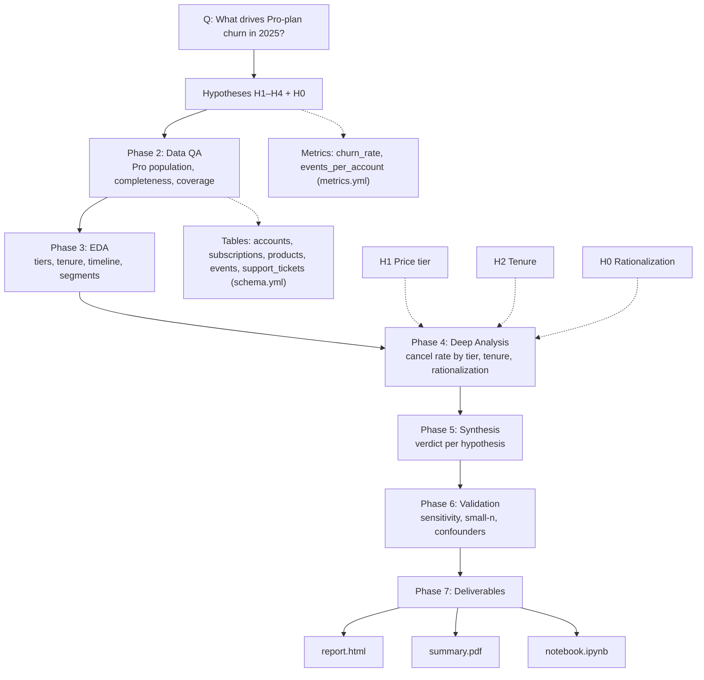

# Analysis Plan — Pro Plan Churn Drivers (2025)

## Results Folder Conventions (do not skip)

- **Per-phase subfolders** under `results/` — never flat: `results/qa/`, `results/eda/`, `results/deep-analysis/`, `results/synthesis/`, `results/validation/`.
- **CSV for every query return** — filename matches the `.sql` exactly.
- **Every SVG chart** includes `viewBox` + `preserveAspectRatio="xMidYMid meet"`, `mr ≥ 80`, titles ≤ 52 chars.
- **Final deliverables:** `deliverables/report.html`, `deliverables/summary.pdf` (real binary PDF), `deliverables/notebook.ipynb` (reloads CSVs, no DB re-query).

---

## Meta

- **Analyst:** Nimrod Fisher, Senior Data Analyst
- **Date started:** 2026-06-14
- **Slug:** pro-plan-churn-drivers
- **Status:** Complete (pending user close-out)
- **Supersedes:** `pro-plan-churn-drivers_2026-06-03_nimrod-fisher` (deleted by user; rebuilt fresh — carrying forward documented learnings only, not prior conclusions).

---

## Question

What characteristics drive churn (subscription cancellation) among Pulseboard **Pro-plan** accounts, viewed against the 2025 active Pro base?

## Decision This Supports

Where to focus Pro-account retention effort — onboarding, pricing/packaging, CS outreach — or to conclude that no intervention is warranted because 2025 "Pro churn" is subscription rationalization rather than customer loss.

---

## Hypotheses

- **H1 (primary) — Price tier.** Higher-priced Pro subscriptions churn more.
  - Confirms if: cancel rate rises monotonically with `monthly_price` tier and the $199 tier is ≥ 1.5× the lowest non-zero tier.
  - Refutes if: cancel rates are flat across tiers within noise.
- **H2 (primary) — Tenure.** $199 churn concentrates early in the subscription lifecycle.
  - Confirms if: median tenure (`canceled_at − started_at`) of canceled $199 subs is well below active-sub tenure and clusters in the first ~90 days.
  - Refutes if: canceled and active tenure distributions overlap with no early-life concentration.
- **H3 (alternative) — Engagement.** Low/declining product activity precedes churn. *Testable only within event coverage (2025-03-07 → 2025-06-06); otherwise inconclusive.*
  - Confirms if: canceled accounts show materially lower pre-cancel event intensity than active peers over a matched window.
  - Refutes if: no gap — or canceled accounts are *more* active (the "engagement paradox").
- **H4 (alternative) — Support burden.** More / unresolved support tickets precede churn.
  - Confirms if: canceled accounts have higher ticket volume or open-rate pre-cancel.
  - Refutes if: no separation from retained accounts.
- **H0 (null) — No driver / rationalization.** Canceled Pro subscriptions are not distinguishable from retained ones beyond noise, and most "churn" is accounts dropping one subscription while staying active. Live data already shows 5/5 of 2025 cancellations retained an active subscription — deep analysis must quantify this cleanly and confirm whether price/tenure still hold once rationalization is separated out.

---

## Required Data

- **Tables (from `schema.yml`):** `accounts` (plan, industry, created_at), `subscriptions` (org_id, product_id, status, started_at, canceled_at, monthly_price), `products` (name, price_monthly), `events`, `support_tickets`, `invoices`.
- **Metrics (from `metrics.yml`):** `churn_rate` = `COUNT(id) WHERE status='canceled'` / `COUNT(id) WHERE status='active'` (subscriptions); `events_per_account` (engagement intensity); `support_volume`.
- **Time window:** All Pro cancellations (2024-07-09 → 2025-05-26 observed), framed against the 2025 active Pro base. Event-based tests limited to 2025-03-07 → 2025-06-06.
- **Segments:** price tier ($29 / $79 / $199), tenure band, industry, true-exit vs rationalization.

## Scope

- **In:** price tier, tenure, engagement (coverage-limited), support burden, industry; rationalization vs true logo exit.
- **Out:** revenue/ARR impact quantification (follow-up); acquisition channels; non-Pro plans except as comparison baseline.

---

## Known Issues Applied (from `learning/known_issues.md`)

1. `accounts.plan` is lowercase → filter `WHERE plan = 'pro'`.
2. `events` coverage ~90 days (2025-03-07 → 2025-06-06) → H3 restricted to in-coverage cancels, else inconclusive.
3. SQL MWU rank-tie bug → if rank-sum used, average-rank `(min+max)/2`, not `RANK()`.
4. Small n (7 cancels, 5 in 2025) → descriptive full-population reporting; confidence capped Medium (price/tenure), Low (industry/support/engagement).

---

## Live Data Grounding (Supabase, read-only, 2026-06-14)

- Pro population: 15 accounts, 34 subscriptions → 25 active, 7 canceled, 2 trialing.
- Cancel rate by tier [canceled / (active+canceled)]: **$29 → 0/9 = 0%**, **$79 → 2/7 ≈ 29%**, **$199 → 5/16 ≈ 31%**.
- Canceled-sub tenure: $199 avg **47d**; $79 avg **244d**. Individual: 15, 18, 24, 75, 101, 148, 339 days.
- Rationalization: only **1 of 7** canceled subs = true logo exit (2024-07-09); **all 5 of 2025 cancels retained an active sub**.

---

## Flow Diagram

---

## Checkpoint Log

### Hypothesis Framed — 2026-06-14
- **Summary:** Question scoped with user — churn = subscription cancellation (`status='canceled'`, `plan='pro'`); time lens = all Pro cancels framed against the 2025 active base. Five hypotheses set with pre-registered confirm/refute criteria. Plan grounded in a read-only Supabase pull (n=7 cancels, 5 in 2025; price-tier and early-tenure signals visible; rationalization dominant).
- **Artifacts:** this `plan.md`, `plan.html`
- **User decision:** _pending_
- **Notes:** Supersedes deleted 2026-06-03 analysis. Confidence will be capped by small n.

### Data QA Complete — 2026-06-14
- **Summary:** Quality score **84/100 — proceed with caveats**. Core churn data pristine (0 nulls, 0 invalid dates, 0 orphans, 0 dup IDs across 15 Pro accounts / 34 subs). Findings: 1 HIGH (products table carries no price signal — use `subscriptions.monthly_price`), 2 MEDIUM (event coverage excludes 3/7 cancels → H3 likely inconclusive; 17% null support categories → H4 use volume), 1 LOW (small n caps confidence).
- **Artifacts:** `results/qa/qa-report.md`, `results/qa/qa-summary.json`, 8× `00_qa-*.csv` + matching `queries/00_qa-*.sql`
- **User decision:** _pending_
- **Notes:** New `known_issues.md` entry added (products price ≠ subscription price).

### EDA Complete — 2026-06-14
- **Summary:** Six findings. (H1) Cancel rate monotonic by tier — $29 0%, $79 28.6%, $199 31.3%. (H2) $199 cancels early (median 24d, 4/5 ≤90d) but $79 cancels late (median 244d). (Timeline) slow trickle, no spike. (H3) canceled accounts MORE active (47 vs 39 events) — disengagement refuted. (H4) no support separation (2.0 vs 1.5 tickets). (H0) 4/5 cancel-accounts still active; 0 true logo exits in 2025.
- **Artifacts:** `results/eda/eda-findings.md`, 3 SVG charts, 7× `0X_eda-*.csv` + matching queries.
- **User decision:** _pending_
- **Notes:** Industry too thin (1–3 accounts/vertical) to read. Engagement coverage-limited (4/7 cancels in window).

### Deep Analysis Complete — 2026-06-14
- **Summary:** H1 — premium 30.4% [15.6,50.9] vs entry $29 0% [0,29.9]; RD 30.4pp; Fisher p≈0.15 (strong direction, not significant at n). H2 — $199 first-90-day hazard 30.8% [12.7,57.6], median canceled tenure 24d; $79 cancels late. H3 refuted (canceled more active). H4 null (2.0 vs 1.5 tickets). H0 rationalization confirmed — 4/5 cancel-accounts retained an active sub, 0 true logo exits in 2025; every cancel-account dropped a $199 sub.
- **Artifacts:** `results/deep-analysis/deep-analysis.md`, `08_da-tier-cancel-ci.svg`, 3× `0X_da-*.csv` + queries.
- **User decision:** _pending_
- **Notes:** Robust H1 claim = "$29 vs everything above" ($79 vs $199 within noise). Rationalization reframes drivers as describing which subs get trimmed, not which customers leave.

### Synthesis Drafted — 2026-06-16
- **Summary:** H1 Moderate (price drives it; real threshold $29-vs-paid, not a gradient). H2 Moderate ($199 early-life, 90-day hazard 30.8%). H3 Refuted/Inconclusive (more active). H4 Null. H0 Strong (rationalization; 0 true logo exits in 2025). Overall: drivers = price tier + early $199 tenure, but 2025 churn is downsizing not loss.
- **Artifacts:** `results/synthesis/synthesis.md`
- **User decision:** _pending_
- **Notes:** Surfaced reframe — best answered as "what drives $199-sub downsizing in first 90 days?". Recommend as report lead, not a re-scope.

### Validation Complete — 2026-06-16
- **Summary:** No conclusion flipped. Added one key caveat — churn is definition-sensitive (logo 7.7% / sub 21.9% / account 38.5% / premium-sub 30.4%); report must name the definition by each rate. Cohort confound tested & rejected ($199 and $79 same age, churn early vs late). H1 replicated at account grain (45.5% vs 0%). Noted 2 subless Pro accounts. All strength ratings held (H1/H2 Moderate, H3 Refuted, H4 Null, H0 Strong).
- **Artifacts:** `results/validation/validation.md`, 3× `1X_val-*.csv` + queries; `synthesis.md` updated with validation note.
- **User decision:** _pending_
- **Notes:** Open: durability of 0-true-exit beyond snapshot.

### Deliverables Ready — 2026-06-16
- **Summary:** Interactive `report.html` (answer-first, definition table, 4 finding cards, recommendations, caveats, appendix), real 1-page `summary.pdf` (rendered via headless Chrome, %PDF-1.4 verified), and `notebook.ipynb` (15 cells, reloads all 15 CSVs — paths verified, valid nbformat 4). `learning/analyses.md` updated.
- **Artifacts:** `deliverables/report.html`, `deliverables/summary.pdf`, `deliverables/notebook.ipynb`
- **User decision:** _pending close-out_
- **Notes:** Status → Complete on user acceptance.
